# Purpose
  The Yoga Club is your go-to place for all ages four plus. Our website offers classes for everyone and comprehensive teacher training programs. Explore to find out more about our sessions, schedules, and training opportunities. Join us and start your journey towards health and wellness today!

# Responsive 
Responsive screen image for the different device, used https://ui.dev/amiresponsive website to capture the image. 

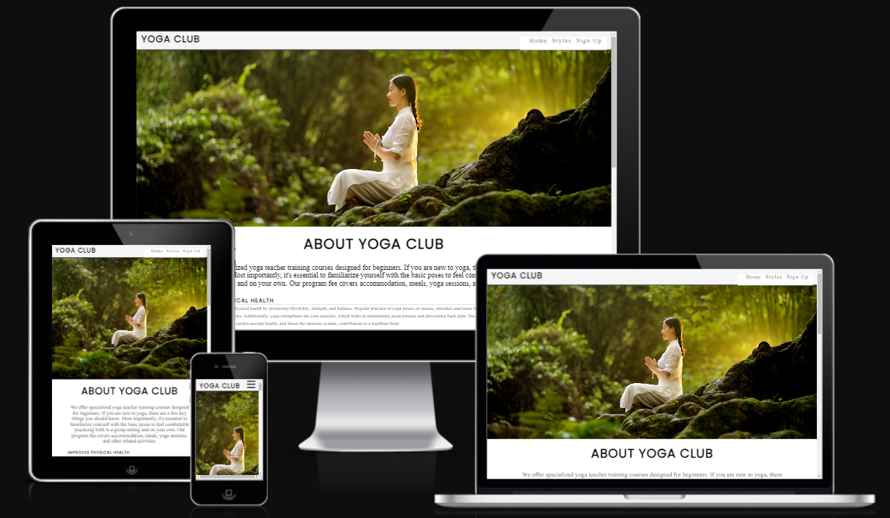

## Project Goals 
### User Goals
- Finding a restaurantYoga Club that offers a Child, Adult, Pregnancy, Online therapy, Teacher trainig.
- See a full schedule plan for day for each session.
- Provide the yoga style poses

### Site Owner Goals
- Increase the number of yoga club joiners.
- Promote the bussines..
- Provide essential information about the yoga to customers.

## User Experience

### Target Audience
- People looking for a club to learn yoga
- People looking for yoga teacher training
- People looking for a family join to the yoga class
- People looking for pregnancy yoga class.

# Features
## Nagivation 
Top of the page show the yoga club at the left corner and in the right corner show the navigation link for Home, styles and signup page

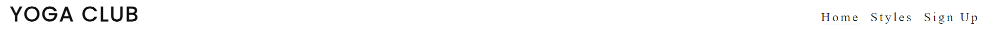

## Screen content
The About us content explains about the yoga club.

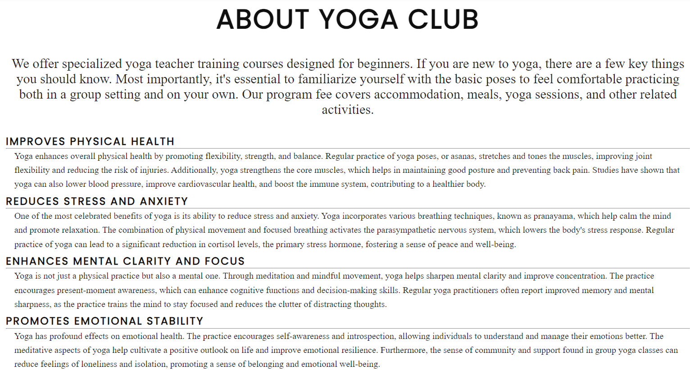

The offer content explain about the course time and details.

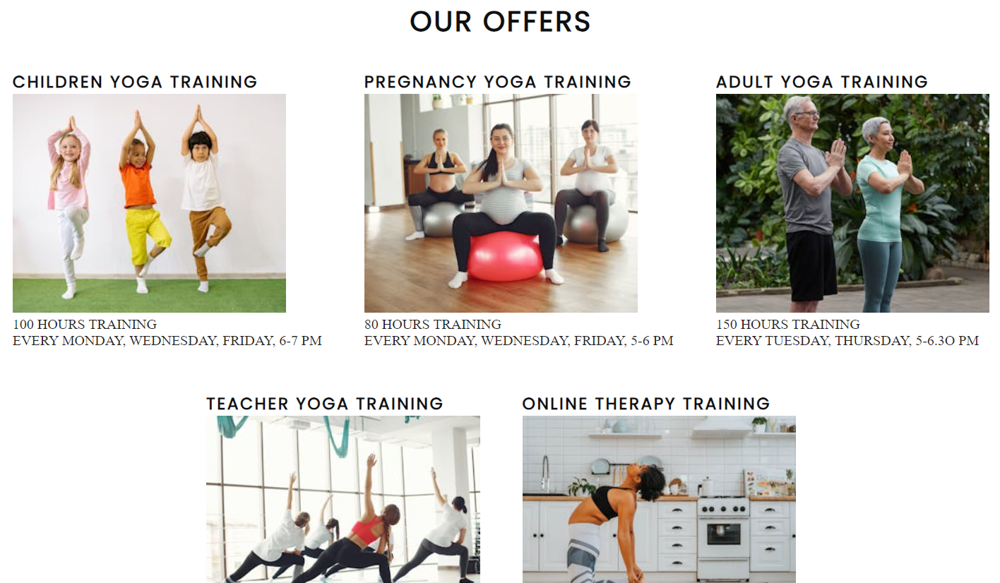

The styles pages expains about the poses of the yoga.

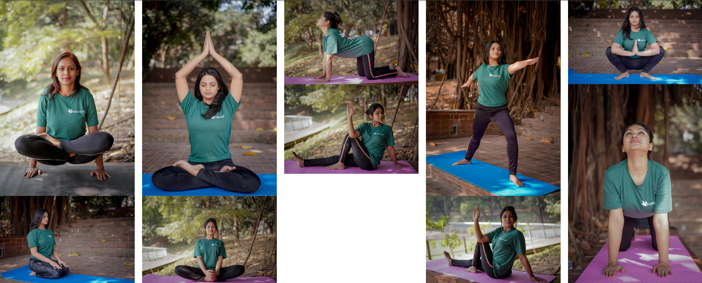

The signup pages expain about the signup for the course with personel details.

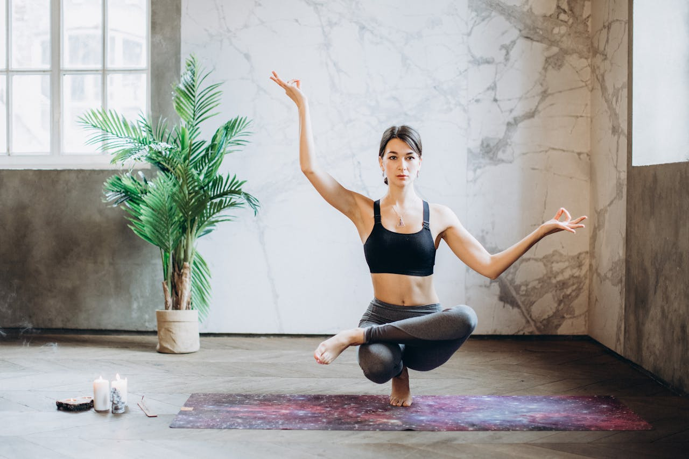

# Performance
Tested the performance by using Google Lighthouse in Google Chrome Developer Tools.  

Home

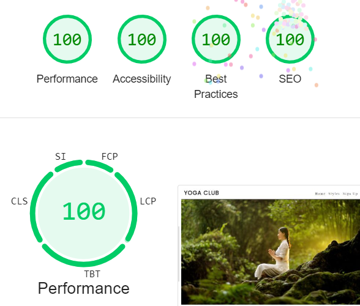

Styles

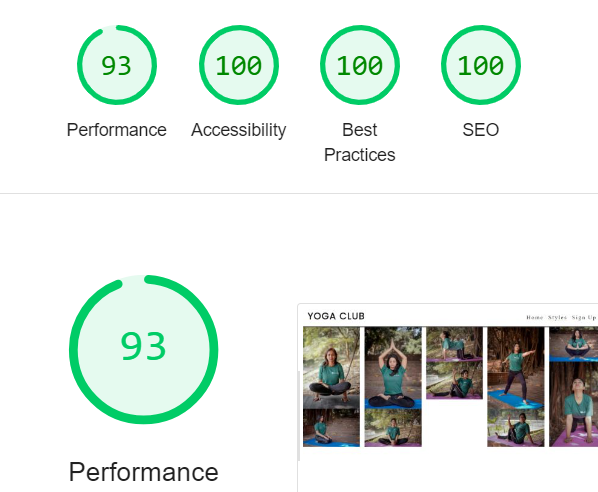

SignUp

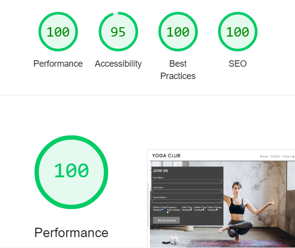

# Validator Test

## HTML
    No error were returned when passing through website: https://validator.w3.org/#validate_by_input

Home

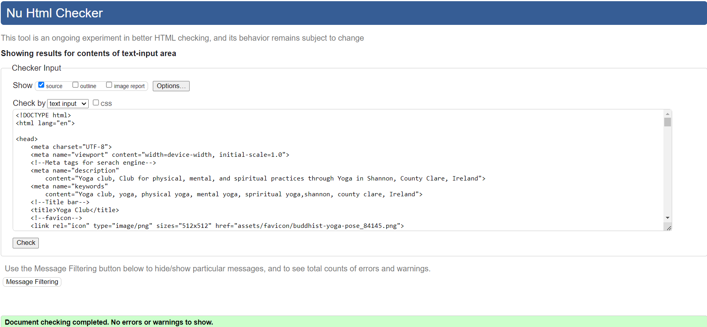

Styles

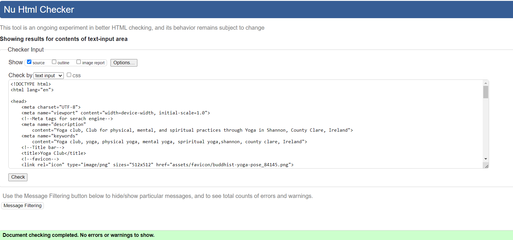

SignUp

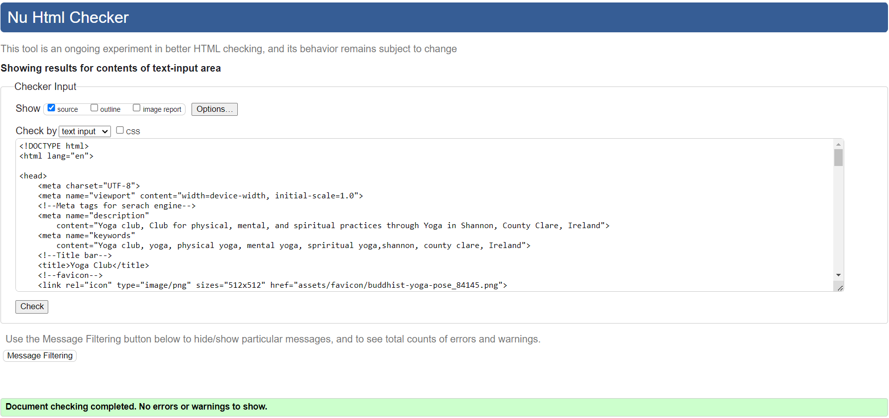

## CSS
    No error were returned when passing through website: https://jigsaw.w3.org/css-validator/#validate_by_input

CSS style

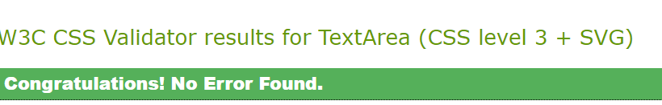

   

# Browser compatability
Tested on the following browsers:  
Google Chrome  
Microsoft Egde 

# Bugs

| **Bug** | **Fix** |
| ----------- | ----------- |
| Form radio button id same for few input | changed the id for different input|
| In the section lack of heading when running code | added the heading with id hidden heading|

# Deployment

The master branch of this repository contains the most up-to-date version and has been utilized for the deployed version of the site. This project was created using the Code Institute student template.

Code Institute Template for CodeAnywhere

  - Click Use This Template button.
  - Give your repository a name, and description.
  - Open CodeAnywhere EDI and log into your account.
  - Click New Workspace button.
  - Create a workspace from your project repository by creating a clone.
Creating a clone

  - From the repository, click Code.
  - In the Clone >> HTTPS section, copy the clone URL for the repository.
  - Paste a link into the designated area on the CodeAnywhere.

Forking

  - From the repository, click Fork.
  - Give your repository a name.
  - Click Create fork.

# Technologies
  - HTML 
  - CSS  

# Credits

## Content

The conent of the about us, our offer all inspired from some yoga clun website. The structure of the website is inspired from the Love Running website.

## Media

All the image are used from the website : https://www.pexels.com/  
All the icon are used from the website: https://fontawesome.com/  
Responsive screen is capture from the website: https://ui.dev/amiresponsive

## Fonts

 Some the font are imported from the website :https://fonts.google.com/

## Acknowledgements

I would like to thank, Harry(Mentor) for support for my project in reviewing and providing some guides.